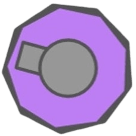

<br><br>
<div align="center">

<h3> diep custom </h3>
<p> An open-source diep.io custom private-server based on AGPL-licensed software </p>
</div>
<br>

## Installation

You may need to install [Node.js](https://nodejs.org/), as well as the [Yarn Package Manager](https://classic.yarnpkg.com/en/docs/install).\
After doing so, download or clone this repository and install the dependencies with:
```bash
$ yarn install
```

## Running the Server

Run the server with:
```bash
$ yarn run server
```
This builds and runs the server.

After running the server, content will be served at `localhost:PORT` on your computer. The port will default to 8080, and you may override it with `process.env.PORT`.

Consult `src/config.ts` for configuration, and `package.json` for environ variable setup.

## Community

This is a modified version of a diep.io private server project.  
No official Discord is currently maintained for this fork.


## License

This project is licensed under the GNU Affero General Public License v3.0.

You must provide source code to users if you run a modified version on a public server.

Please see [LICENSE](./LICENSE)
